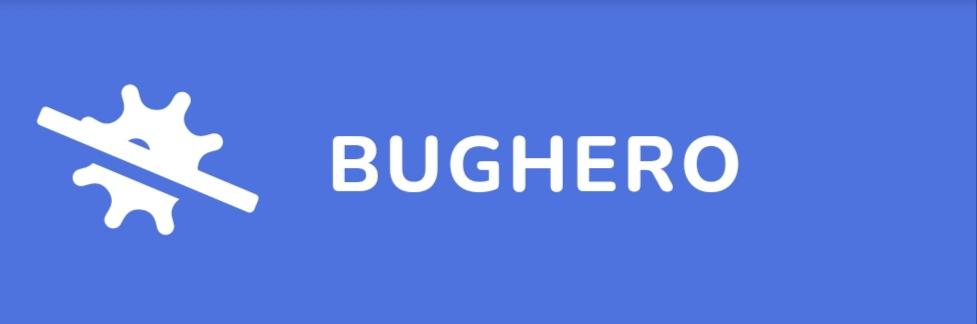

<!--
*** Thanks for checking out the Best-README-Template. If you have a suggestion
*** that would make this better, please fork the repo and create a pull request
*** or simply open an issue with the tag "enhancement".
*** Thanks again! Now go create something AMAZING! :D
-->


<!-- PROJECT SHIELDS -->
<!--
*** I'm using markdown "reference style" links for readability.
*** Reference links are enclosed in brackets [ ] instead of parentheses ( ).
*** See the bottom of this document for the declaration of the reference variables
*** for contributors-url, forks-url, etc. This is an optional, concise syntax you may use.
*** https://www.markdownguide.org/basic-syntax/#reference-style-links


[![Contributors][contributors-shield]][contributors-url]
[![Forks][forks-shield]][forks-url]
[![Stargazers][stars-shield]][stars-url]
[![Issues][issues-shield]][issues-url]
[![MIT License][license-shield]][license-url]
[![LinkedIn][linkedin-shield]][linkedin-url]


-->

<!-- PROJECT LOGO -->
<br />
<p align="center">
  <a href="https://github.com/fillateo/BugHero">
    
  </a>

  <h3 align="center">BugHero</h3>

  <p align="center">
    Web based application for tracking issues in your personal or collaborative projects!
    <br />
    <br />
    <a href="https://bug-hero.herokuapp.com"><strong>View Demo</strong></a>
    ·
    <a href="https://github.com/fillateo/BugHero/issues"><strong>Report Bug</strong></a>
    ·
    <a href="https://github.com/fillateo/BugHero/issues"><strong>Request Feature</strong></a>
  </p>
</p>


<!-- TABLE OF CONTENTS -->
<details open="open">
  <summary>Table of Contents</summary>
  <ol>
    <li>
      <a href="#features">Features</a>
      <ul>
        <li><a href="#built-with">Built With</a></li>
      </ul>
    </li>
    <li>
      <a href="#getting-started">Getting Started</a>
      <ul>
        <li><a href="#prerequisites">Prerequisites</a></li>
        <li><a href="#installation">Installation</a></li>
      </ul>
    </li>
    <li><a href="#usage">Usage</a></li>
    <li><a href="#contact">Contact</a></li>
    <li><a href="#acknowledgements">Acknowledgements</a></li>
  </ol>
</details>


<!-- FEATURES -->
## features


* User Authentication & Authorization
* Login with OAuth2 (Google)
* Issue by type, priority & status
* Issue comment
* Assign user members in project
* Attach additional files in project

### Built With

Technologies that I used for build this project.
* [MDBootstrap](https://mdbootstrap.com/)
* [Nodejs](https://nodejs.org/en/)
* [Express](expressjs.com)
* [MongoDB](mongodb.com)


<!-- GETTING STARTED -->
## Getting Started

Follow instructions below for running this app on your machine.

### Prerequisites

Make sure you have installed all of the following prerequisites on your machine.

* Git
* Node.js
* MongoDB

### Installation

1. Clone the repo
```sh
git clone https://github.com/fillateo/BugHero.git
```
2. Install NPM packages
   ```sh
   npm install
   ```
4. Create file config.env inside of config/ folder & Enter your PORT, MONGO_URI, GOOGLE_CLIENT_ID, GOOGLE_CLIENT_SECRET & ABSOLUTE_URL in `config.env`
   ```sh
   PORT = 5000
   MONGO_URI = Enter your mongo url
   GOOGLE_CLIENT_ID = Enter your Google Client Id
   GOOGLE_CLIENT_SECRET = Enter your Google Client Secret
   ABSOLUTE_URL = Enter your Absolute URL (only required in production mode)
   ```


<!-- USAGE EXAMPLES -->
## Running the App

For development mode:
```sh
  npm run dev
```

For production mode:
```sh
npm run start
```

App will runnig on port 5000 & if you are in development mode, just go to http://localhost:5000.


<!-- CONTACT -->
## Contact Me
Jait Ramadandi Jeke - <jaitramadandij@gmail.com>
